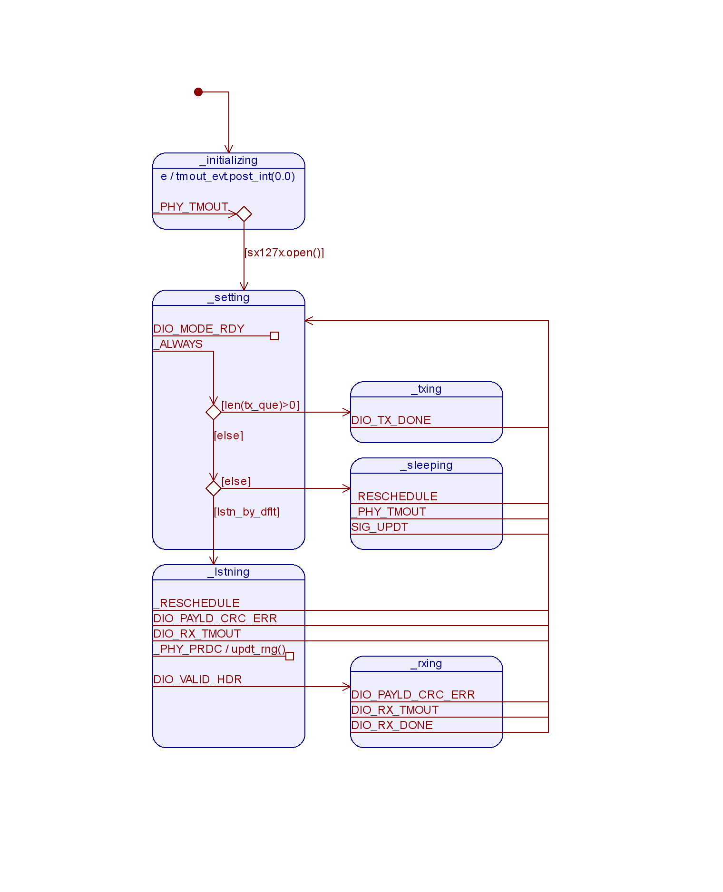

phy_sx127x
==========

Introduction
------------

A physical layer (PHY) driver for the `Semtech SX127x family`_  
of radio data transceivers written in Python3 
using the `farc`_ state machine framework and meant to run on
Linux on a Raspberry Pi 3 with a modified `Dragino LoRa GPS Hat`_

A state machine manages the operational behavior and calls into a PHY layer module
to interact with the radio via the SPI bus and GPIO pins.

This repository is designed to be a git submodule
so that it may be re-used by multiple projects
and is not operational on its own.

.. _`Semtech SX127x family`: https://www.semtech.com/products/wireless-rf/lora-transceivers/sx1276
.. _`farc`: :https://github.com/dwhall/farc
.. _`Dragino LoRa GPS Hat`: https://wiki.dragino.com/index.php?title=Lora/GPS_HAT

Software
--------

phy_sx127x_ahsm.py
    Contains PhySX127xAhsm, the PHY layer state machine that automates 
    the behavior of the Semtech SX127x family of radio transceivers.

phy_sx127x.py
    Contains PhySX127x, the PHY layer SPI operations, settings management 
    and GPIO interfaces for the Semtec SX127x family of digital radio transceivers.

State Machine
-------------

After initialization, the behavior of the state machine is to run
in a loop that applies settings and then performs an action.
That action is to transmit, listen or sleep.
The state machine instance maintains a transmit queue
and a boolean variable that it uses decide what action to take.
If the transmit queue is empty, the variable determines
whether to listen or sleep.
If the queue is not empty, the next item in the queue
will be transmitted.  After the transmission, operation proceeds 
to the Setting state and the entire process repeats.
But the Sleeping and Listening states are slightly different.
The SM remains in Sleeping or Listening until some event arrives 
that requires attention (for example, a new item in the transmit 
queue or a new setting needs to be applied).

One other thing to mention is that the Listening state turns
on the radio receiver, but only the reception of a valid
header will cause the transitio to the Rxing state.
The Rxing state exists solely to keep the radio in receive
mode until reception is done or there is a timeout.
We wouldn't want, for example, the arrival of a new item
in the transmit queue to cause a state transition that
would turn off the receiver.

There are many more details to the state machine's operation.
But that is the jist of it.  See the code for details.
Likewise, the diagram below shows the important aspects of the
state machine, but it does not completely capture the details.

Hardware
--------

The prototype platform is a `Raspberry Pi 3 Model B`_
with a `Dragino LoRa/GPS Hat`_ that I bought `on Tindie`_.
They sent me version 1.3 of the PCB eventhough there are later versions.
So I had to make a couple fixes and a few additions.  The first and most
important fix is to connect the radio's SPI Chip Select (CS) signal to the Pi's
SPI0 CS0.  Without that, you have to programmatically control the radio's CS
before and after every transaction (that's a PITA that slows hardware and
software).  It's better to connect the Pi's CS so the Pi's SPI peripheral
(hardware) can control the CS signal automatically. The additions are direct
connections from the radio's DIOn pins to the Pi's GPIO and the GPS's Pulse Per
Second (PPS) signal to the Pi.

Below is a table of the connections between the Raspberry Pi and the
LoRa radio.  The "Mod" column indicates where I needed to solder
a wire to make the connection.  If the Mod column is empty that means the
connection is made by a trace in the Dragino PCB.

======   ========   ===   ===   ===   =========   ===  
Device   Signal     pin         pin   Pi signal   Mod  
======   ========   ===   ===   ===   =========   ===  
LoRa     SPI MISO   10          21    SPI0 MISO        
LoRa     SPI MOSI   11          19    SPI0 MOSI        
LoRa     SPI SCLK   12          23    SPI0 SCLK        
LoRa     SPI SS     13          22    GPIO 25     1    
LoRa     SPI SS     13          24    SPI0 CS0    W    
LoRa     DIO0       6           7     GPIO 4           
LoRa     DIO1       7           16    GPIO 23          
LoRa     DIO2       8           18    GPIO 24          
LoRa     DIO3       3           31    GPIO 6      W    
LoRa     DIO4       4           29    GPIO 5      W    
LoRa     DIO5       15          15    GPIO 22     W    
LoRa     RESET      14          11    GPIO 17          
======   ========   ===   ===   ===   =========   ===  

======   ========================================  
Mod      Explanation                               
======   ========================================  
W        Added a fly wire                          
1        Either GPIO25 always remains an unusable input, or cut trace to Pi's pin22.  
======   ========================================  

.. _Raspberry Pi 3 Model B: https://www.raspberrypi.org/products/raspberry-pi-3-model-b/?resellerType=home
.. _`Dragino LoRa/GPS Hat`: http://wiki.dragino.com/index.php?title=Lora/GPS_HAT
.. _`on Tindie`: https://www.tindie.com/products/edwin/raspberry-pi-hat-featuring-gps-and-lorar-technolog/

Reference
---------

This project contains design files and documentation that may be opened with
open source applications.  The following table gives an application that will
open each type of file:

=========== =============== ==============
Extension   Application     Download link 
=========== =============== ==============
.qm         `QP Modeler`_   `github`_ 
=========== =============== ==============

.. _github: https://github.com/QuantumLeaps/qm/releases
.. _QP Modeler: https://www.state-machine.com/qm/
