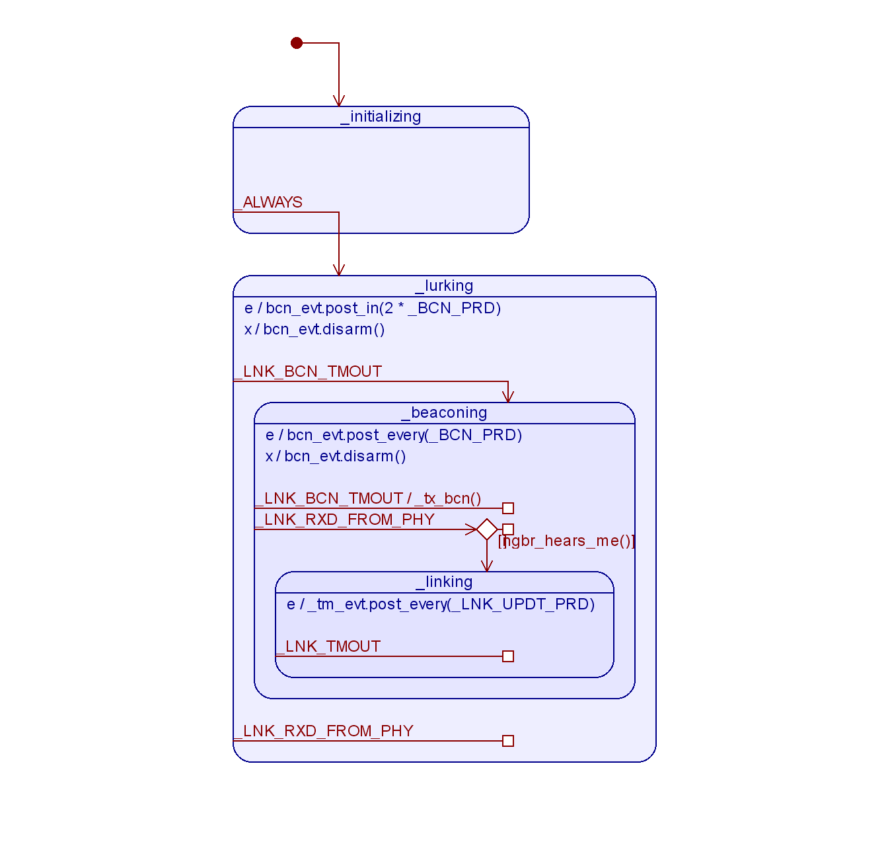

Heymac Link Layer
=================

Introduction
------------

A data link layer (LNK) that provides a frame format
and automated link data management via a state machine.
This package uses the `farc`_ state machine framework and
drives a `Semtech SX127x radio`_.

A state machine manages the operational behavior and calls into other LNK layer modules
to generate and parse frames, manage link layer data and manage the PHY.

This repository is designed to be a git submodule
so that it may be re-used by multiple projects
and is not operational on its own.

.. _`farc`: https://github.com/dwhall/farc
.. _`Semtech SX127x radio`: https://www.semtech.com/products/wireless-rf/lora-transceivers/sx1276

Software
--------

heymac_hsm.py
    Contains HeymacHsm, the link layer state machine.

heymac_frame.py
    Contains HeymacFrame, which has methods to build or parse a link layer frame.

Public Interface
----------------

This section describes the public interface of the LNK layer,
which is the set of methods and arguments available to the entity
that instantiates the LNK layer.

======================  ================================================
Callable                Description
======================  ================================================
``HeymacHsm()``     Constructor for the state machine
                        accepts one argument.

                        - *arg* tbd
----------------------  ------------------------------------------------
``HeymacFrame()``       Constructor for a class that helps build a
                        link layer frame object or
                        parse bytes into a frame object.
----------------------  ------------------------------------------------
``HeymacFrameError``    An exception thrown when a HeymacFrame is parsed
                        via parse() or serialized via bytes() and the
                        Fctl bits and data fields are mismatched
======================  ================================================

State Machine
-------------

Settings
--------

TBD

Reference
---------

Ahsm
    Augmented Hierarchical State Machine.  A statechart capable of nested states
    with entry and exit handlers and having a message queue to serialize incoming events.

This project contains design files and documentation that may be opened with
open source applications.  The following table gives an application that will
open each type of file:

=========== =============== ==============
Extension   Application     Download link
=========== =============== ==============
.qm         `QP Modeler`_   `github`_
=========== =============== ==============

.. _github: https://github.com/QuantumLeaps/qm/releases
.. _QP Modeler: https://www.state-machine.com/qm/
